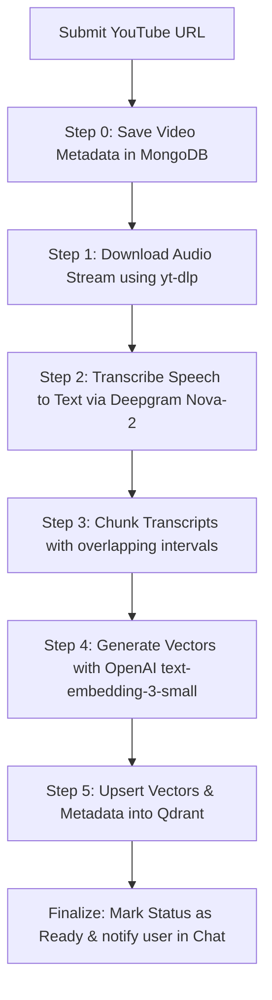

# 🎥 VidSearch: AI-Powered YouTube Video Intelligence Studio

VidSearch is a modern web application built on Next.js 16+ that lets you download, transcribe, index, and chat with any YouTube video. By combining speech-to-text transcription, vector search embeddings, and LLM completions, VidSearch allows users to locate specific spoken words instantly, watch corresponding video segments with a custom control deck, and download individual or merged audio/video clips of those segments.

---

## 🌟 Key Features

- **🔗 Fast Video Ingestion**: Enter any YouTube link to trigger a background processing pipeline.
- **🎙️ Speech-to-Text Transcription**: Automatically transcribe the video's audio track with high accuracy using Deepgram's **Nova-2** model.
- **🔍 Semantic Vector Search**: Segment transcripts into overlapping chunks, generate embeddings using OpenAI's `text-embedding-3-small` model, and store them in a local **Qdrant** vector database.
- **💬 Conversational AI**: Ask questions about the video and get precise answers powered by OpenAI's `gpt-4o-mini`, with exact hyperlinked timestamps (`[MM:SS]`) that seek the video player to the correct moment.
- **🌐 Multilingual Support**: Chat with the video and receive answers in the language of your query (e.g., Hindi, Spanish, Arabic, English, etc.).
- **✂️ Video & Audio Clipping**: Select key transcribed segments from your chat response and download individual clips or merge multiple segments into a single concatenated file on-the-fly.
- **🎨 Premium Dark UI**: A glassmorphic design featuring smooth animations, live progress indicators, and custom video player controls.

---

## 🛠️ Tech Stack

- **Framework**: [Next.js 16](https://nextjs.org/) (App Router)
- **Language**: TypeScript
- **Database**: [MongoDB](https://www.mongodb.com/) (Metadata, transcript, and chat logs storage)
- **Vector DB**: [Qdrant](https://qdrant.tech/) (Vector indexing and semantic search)
- **Job Orchestration**: [Inngest](https://www.inngest.com/) (Asynchronous background processing queues)
- **AI Integrations**:
  - [OpenAI API](https://openai.com/) (Text embeddings & Chat Completions)
  - [Deepgram API](https://deepgram.com/) (Nova-2 Speech-to-Text model)
- **Media Processing Tools**:
  - `yt-dlp` (Python script to fetch audio stream)
  - `FFmpeg` (Cut, re-encode, and concatenate audio/video clips)
- **Styling**: Tailwind CSS v4

---

## 📋 Prerequisites & System Dependencies

Before running this application, you must install the following software on your local host machine:

### 1. Node.js & NPM
Ensure you have **Node.js (v18.x or higher)** installed.
```bash
node -v
npm -v
```

### 2. Docker
Docker is required to run the Qdrant vector database container.
- [Download Docker Desktop](https://www.docker.com/products/docker-desktop/)

### 3. Python & yt-dlp
The background downloader uses Python and `yt-dlp` to download audio streams from YouTube.
1. Install **Python 3**.
2. Run the following command to install the `yt-dlp` library globally:
   ```bash
   pip install yt-dlp
   ```

### 4. FFmpeg
FFmpeg is used to slice and merge media files.
1. Download and install **FFmpeg** for your operating system.
2. Ensure `ffmpeg` is added to your system's `PATH` variable so it can be executed globally.
   - **Verification**: Run `ffmpeg -version` in your terminal. It should output version details.

---

## 🚀 Step-by-Step Installation Guide

### Step 1: Clone the Repository
```bash
git clone https://github.com/minaamulhaq/Yt-Video-Search.git
cd Yt-Video-Search
```

### Step 2: Install Node Dependencies
```bash
npm install
```

### Step 3: Configure Environment Variables
Create a file named `.env` in the root directory and configure the environment variables as follows:

```env
# MongoDB Connection URI (Local or MongoDB Atlas)
MONGODB_URI=mongodb://localhost:27017/vidserch

# OpenAI API Key (Required for text-embedding-3-small and gpt-4o-mini)
# Note: Ensure the variable name is exactly "OPENAI_API" as expected by the codebase.
OPENAI_API=your-openai-api-key-here

# Deepgram API Key (Required for transcription)
DEEPGRAM_API=your-deepgram-api-token-here
```

> [!WARNING]  
> Notice that the variable name is **`OPENAI_API`**, not `OPENAI_API_KEY`, and MongoDB uses **`MONGODB_URI`** (or fallback **`NEXT_PUBLIC_MONGOES_URI`**). Double check your variable names!

---

### Step 4: Run Qdrant Vector Database
Use the provided `docker-compose.yml` to start the Qdrant database:
```bash
docker compose up -d
```
*Alternatively, you can run Qdrant manually via Docker:*
```bash
docker run -p 6333:6333 -p 6334:6334 -v qdrant_storage:/qdrant/storage qdrant/qdrant:latest
```

---

### Step 5: Start the Inngest Dev Server
Since the video ingestion pipeline runs as asynchronous step functions, you need the Inngest Dev Server running locally to orchestrate jobs.

In a new terminal window, start the Inngest Dev Server:
```bash
npx inngest-cli@latest dev -u http://localhost:3000/api/inngest
```
Leave this running in the background. It will automatically detect your local Next.js instance and run background ingestion tasks.

---

### Step 6: Start the Next.js App
In another terminal, start the Next.js development server:
```bash
npm run dev
```

Open [http://localhost:3000](http://localhost:3000) in your browser to start using VidSearch!

---

## 🔄 How the Ingestion Pipeline Works

When you submit a YouTube URL, the **Inngest** background execution runs a 5-step pipeline:



1. **Store Metadata**: Creates a Mongoose record with a processing status.
2. **Download source**: Invokes Python's `yt-dlp` to download the high-quality audio track to `/tmp` as a `.webm` file.
3. **Transcribe**: Streams the `.webm` audio buffer to Deepgram's API to receive exact word timestamps.
4. **Chunking**: Sentence-level segment assembly with semantic overlaps (aiming for 20–40 seconds or ~300 tokens per chunk).
5. **Create Embeddings**: Calls OpenAI's `embeddings` endpoint.
6. **Store in Qdrant**: Populates the local `youtube_chunks` collection with 1536-dimension vectors.
7. **Finalize**: Updates the database status to `ready` so you can start searching and chatting!

---

## 📽️ Using the Video Chat & Downloader

1. **Ask Questions**: Ask things like *"When does he talk about deployment?"* or *"What did the speaker say about Python scripts?"*
2. **Retrieve Segments**: The AI will query Qdrant to pull relevant transcriptions. The response will include clickable timestamps.
3. **Time-sync Playback**: Click any timestamp in the chat to instantly seek to that point in the video.
4. **Download Clips**:
   - Check the boxes next to relevant segments in the AI response cards.
   - Click **Download Clip** to download individual segments.
   - Select multiple checkboxes and click **Download Merged Clip** to merge separate parts chronologically into a single download!

---

## 🐞 Troubleshooting

- **FFmpeg Errors**: If clipping downloads fail, verify that `ffmpeg` is successfully configured in your environment path by running `ffmpeg` in your command line.
- **Python / yt-dlp issues**: If ingestion fails on step 1, ensure `python` is installed on your host machine and that `pip install yt-dlp` was run.
- **Inngest tasks don't start**: Make sure you have the Inngest Dev Server running (`npx inngest-cli dev`). Check the Inngest UI at [http://localhost:8288](http://localhost:8288) to see job logs and inspect failures.
- **OpenAI / Deepgram Authorization Fails**: Verify your `.env` keys. Remember to name the OpenAI key `OPENAI_API`.
